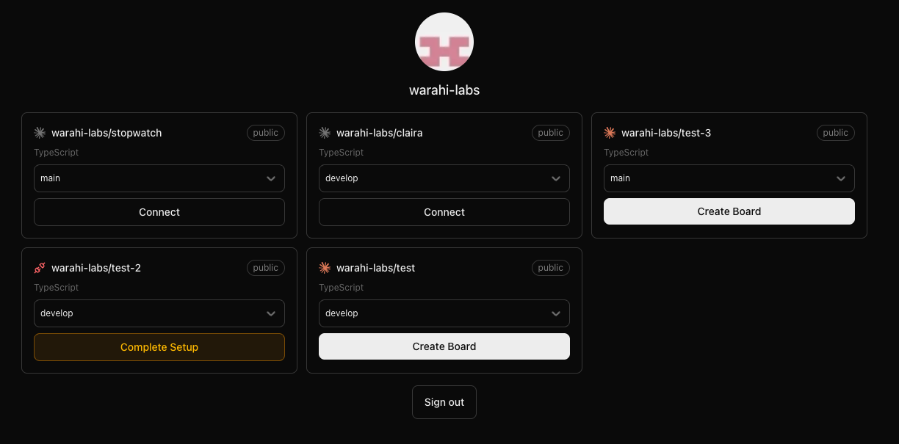
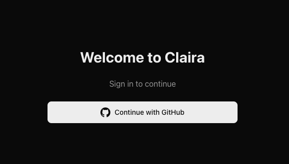
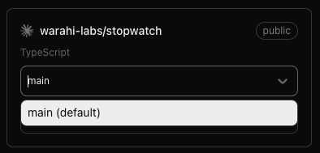

# Claira

Claira is a kanban-style board for running automated [Claude Code](https://docs.claude.com/en/docs/claude-code/github-actions) workflows against your GitHub repositories: describe work as cards, and let Claude Code pick them up and execute them through GitHub Actions.

The current version implements the first step of that flow — connecting repositories. Sign in with GitHub, see at a glance which repos are connected, and complete the setup for any repo in a couple of clicks: Claira opens the workflow PR and stores the Claude Code token as a repository secret for you. Once a repo is connected, you can create a board for it (the board itself is under active development).



## Features

- **GitHub sign-in** — OAuth via [Auth.js](https://authjs.dev), requesting the `repo` and `workflow` scopes needed to manage workflows and secrets.
- **Connection status per repo** — each repo card checks whether `.github/workflows/claude.yml` matches the expected workflow and whether the `CLAUDE_CODE_OAUTH_TOKEN` secret exists, and shows connected / partially configured / not set up.
- **Branch selection** — pick which branch the workflow check and setup PR target; branches are loaded lazily when the dropdown opens.
- **Guided connect flow** — a modal walks through installing the [Claude GitHub App](https://github.com/apps/claude), creating a PR that adds the workflow file, and saving your Claude Code token (generated with `claude setup-token`). The token is encrypted with a libsodium sealed box against the repo's public key before upload, per the GitHub Actions secrets API.
- **Create board** — once a repo is fully connected, create a kanban board for it. Boards are where automated workflows will be managed (under active development).

## Roadmap

- [x] GitHub authentication and repo connection flow
- [ ] Kanban boards per repository
- [ ] Cards that trigger Claude Code runs via GitHub Actions
- [ ] Tracking workflow runs and PRs from the board

| Sign in | Branch selection |
| --- | --- |
|  |  |

## Tech stack

- [Next.js 16](https://nextjs.org) (App Router, Turbopack) with React 19
- [Auth.js (NextAuth v5)](https://authjs.dev) with the GitHub provider
- [Tailwind CSS 4](https://tailwindcss.com)
- [libsodium](https://github.com/jedisct1/libsodium.js) for encrypting GitHub Actions secrets

## Getting started

### 1. Create a GitHub OAuth app

1. Go to GitHub → Settings → Developer settings → [OAuth Apps](https://github.com/settings/developers) → **New OAuth App**.
2. Set **Homepage URL** to `http://localhost:3000`.
3. Set **Authorization callback URL** to `http://localhost:3000/api/auth/callback/github`.
4. Note the **Client ID** and generate a **Client secret**.

### 2. Configure environment variables

Create a `.env.local` (or `.env`) file in the project root:

```bash
AUTH_SECRET=          # generate with: openssl rand -base64 32
AUTH_GITHUB_ID=       # OAuth app client ID
AUTH_GITHUB_SECRET=   # OAuth app client secret
```

### 3. Install and run

```bash
npm install
npm run dev
```

Open [http://localhost:3000](http://localhost:3000) and sign in with GitHub.

## Connecting a repository

1. Install the [Claude GitHub App](https://github.com/apps/claude) on the repository.
2. Click **Connect** on the repo card. Claira creates a PR adding `.github/workflows/claude.yml` to the selected branch.
3. Run `claude setup-token` in your terminal and paste the token into the modal — it's saved to the repo as the `CLAUDE_CODE_OAUTH_TOKEN` Actions secret.
4. Merge the PR. The card shows the Claude logo in color once the repo is fully connected.
